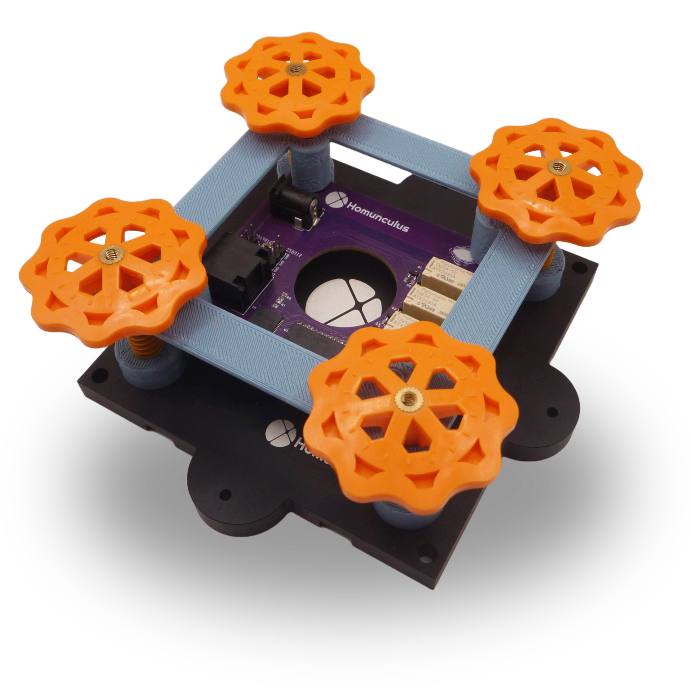
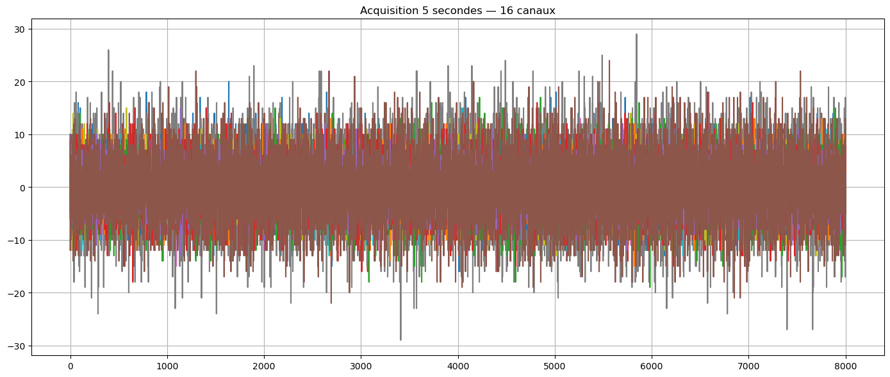
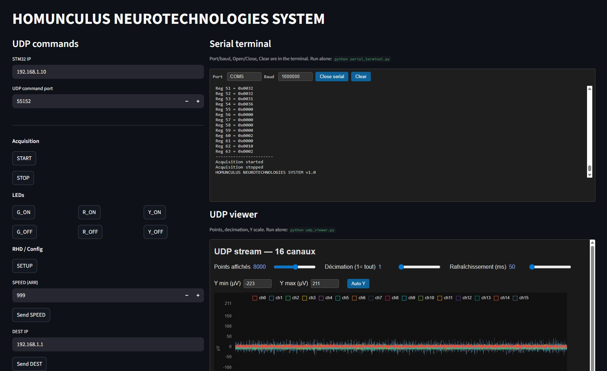

# HOMUNCULUS Neurotechnologies — HMCLS integration examples

This repository provides reference examples for working with data from the **HMCLS system**: receiving multi-channel streams over UDP, sending control commands, viewing live waveforms, and running offline signal analysis (FFT, PSD, coherence, per-channel statistics). The code is intended to be reused or adapted to integrate HMCLS into your own applications.




## Main files

1. **[app.py](app.py)** (Streamlit app) — Integration demo that connects to the HMCLS system: UDP command panel (acquisition START/STOP, LEDs, RHD config, SPEED/DEST), embedded serial terminal, and live 16-channel waveform viewer. Illustrates a single-window workflow for control and monitoring.

2. **[receive_udp.ipynb](receive_udp.ipynb)** (Analysis notebook) — System characterization: acquisition over UDP, then FFT spectrum, PSD (Welch), inter-channel coherence, and per-channel statistics (RMS, std, peak-to-peak). Use it to assess noise, mains pickup (50/60 Hz), and channel behaviour. The tests behind the results in this notebook were performed with our **MEA in saline solution** to characterize the system under controlled conditions.

   

The remaining scripts and notebooks are supporting utilities; they can be launched from the Streamlit app or run independently. See the table below for links to each file.

---

## What each piece of code does

| File | Description |
|------|-------------|
| **[app.py](app.py)** | Streamlit integration demo: HMCLS IP and command port, START/STOP, LEDs (G/R/Y), RHD/SETUP, SPEED, DEST, GET_IP/GET_SPEED/STATUS/VERSION/HELP, MONITOR. Embeds the serial terminal and UDP viewer; optionally starts them as subprocesses when you run `streamlit run app.py`. |
| **[receive_udp.ipynb](receive_udp.ipynb)** | Acquires 16-channel data on UDP (port 55151), then runs FFT (full spectrum and 50/60 Hz zoom), coherence vs channel 0, Welch PSD, and per-channel stats (RMS, STD, peak-to-peak). |
| **[udp_viewer.py](udp_viewer.py)** | Flask app that listens on the UDP data port, maintains a rolling buffer of 16-channel data, and serves a web UI with configurable points and decimation. Can run standalone or inside the Streamlit app. |
| **[serial_terminal.py](serial_terminal.py)** | Web-based serial terminal (Flask + SSE): open a COM port, send/receive text, clear output. For debugging or communication with devices on the same serial line. |
| **[send_udp.ipynb](send_udp.ipynb)** | Jupyter examples for sending UDP commands (START, STOP, LEDs, etc.) to the HMCLS system. Useful for scripting or quick tests without the Streamlit UI. |

---

## Features

- **Streamlit dashboard** — UDP commands and embedded serial terminal + live waveform viewer
- **UDP viewer** — Real-time 16-channel display with configurable range and decimation
- **Serial terminal** — Web-based serial console for configuration and debugging
- **Analysis notebook** — FFT, PSD, coherence, and per-channel statistics for system characterization

## Requirements

- Python 3.8 or newer
- Dependencies are listed in **[requirements.txt](requirements.txt)** (Streamlit app, Flask services, and Jupyter notebooks).

**Install everything in one go:**

```bash
pip install -r requirements.txt
```

This installs: `streamlit`, `flask`, `numpy`, `pyserial` (app and viewers), and `matplotlib`, `pandas`, `scipy` (notebooks). Use a virtual environment if you prefer to keep the project isolated (e.g. `python -m venv .venv`, then activate it and run the command above).

## Quick start

From the project directory (after [installing dependencies](#requirements) with `pip install -r requirements.txt`):

**Recommended:** run the Streamlit app; it can start the serial terminal and UDP viewer automatically.

```bash
streamlit run app.py
```

Open the URL displayed (default `http://localhost:8501`). The left panel provides UDP commands (HMCLS system IP and port 55152); the right panel embeds the serial terminal and live waveform viewer.



**Run services separately** (e.g. for debugging):

```bash
python serial_terminal.py              # http://127.0.0.1:8765
python udp_viewer.py                  # http://127.0.0.1:5000
python udp_viewer.py --udp-port 55151 # optional: different data port
streamlit run app.py                  # expects the above ports if using iframes
```

**Notebooks**

- **[receive_udp.ipynb](receive_udp.ipynb)** — Acquire 16-channel data over UDP, then run FFT, PSD, coherence, and per-channel statistics. For system characterization (noise, 50/60 Hz, channel behaviour). The reference results were obtained with our MEA in saline solution. Default: 8 kHz, up to 20 kHz.
- **[send_udp.ipynb](send_udp.ipynb)** — Examples for sending UDP commands (START, STOP, LEDs, etc.) to the HMCLS system.

## Ports

| Port   | Usage |
|--------|--------|
| 55151  | UDP data stream (16 channels, from HMCLS system) |
| 55152  | UDP commands to HMCLS (START, STOP, LEDs, SPEED, DEST, etc.) |
| 5000   | UDP viewer (Flask) |
| 8765   | Serial terminal (Flask) |
| 8501   | Streamlit app (default) |

## Configuration

- **HMCLS system IP** — Configure in the app or in the notebooks (default `192.168.1.10`).
- **Serial** — Default COM port and baud rate can be set via the `SERIAL_PORT` and `SERIAL_BAUD` environment variables (app pre-fill: `COM5`, `1000000`).

---

**Homunculus Neurotechnologies** — HMCLS multi-channel acquisition and integration reference.  
[https://hmcls.com](https://hmcls.com)
